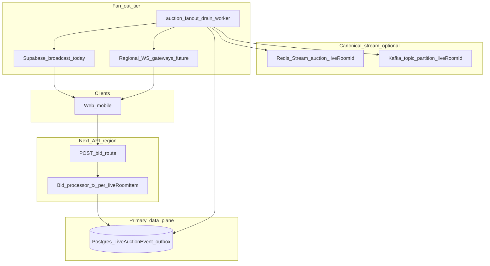

# Production live auction — architecture

This document describes the **target** production architecture integrated with the Get Vaulted Node/TypeScript stack. The repo implements the **authoritative Postgres path** (`LiveAuctionEvent`, `auctionEventSeq`) plus **optional** Redis Streams / Kafka sidecars (`src/lib/live-auction-stream/sidecars.ts`) and **host-lot proxy bids** (`LiveAuctionProxyBid`).

## Honest latency stance

**Sub‑10 ms p95 end‑to‑end globally is not a defensible SLA** (last‑mile cellular, TLS, browser scheduling). What we guarantee in software:

| Layer | Guarantee |
|-------|-----------|
| **Ordering** | Monotonic `auctionSeq` per `liveRoomId`; deterministic conflict resolution in the bid processor transaction. |
| **Durability** | Accepted bids append `LiveAuctionEvent` in the same transaction as room/item state (single writer per hot row). |
| **Fan‑out** | Decoupled from the commit path (`after()` or `scripts/auction-fanout-drain.ts`); horizontally scalable consumers read pending rows or Redis/Kafka. |
| **Viewer freshness** | **Regional** p95 targets (see `ACCEPTANCE-SLA.md`): same‑metro tens–hundreds of ms is realistic; cross‑region adds RTT unless you deploy regional gateways. |

## Component diagram

## Responsibilities

| Component | Responsibility |
|-----------|----------------|
| **Bid API** (`src/app/api/live-rooms/[id]/items/[itemId]/bid/route.ts`) | AuthZ, validation, idempotency read, delegates to Prisma transaction; schedules fan‑out flush. |
| **Bid processor (in‑process)** | Single ordered pipeline per request: `updateMany` guards, `LiveRoom` seq bump, `LiveAuctionEvent` append, **host proxy chain** (`resolve-live-proxy-bid-chain.ts`). |
| **`LiveAuctionEvent`** | Durable canonical log; `seq` unique per room; `publishedAt` for outbox flush state. |
| **Sidecars** | Best‑effort dual‑write to Redis `XADD` / Kafka for external consumers and replay tooling. |
| **Fan‑out worker** | `flushPendingLiveAuctionFanout`: reads unpublished rows, publishes sidecars + Supabase broadcast, marks `publishedAt`. |
| **Client** (`LiveRoomShell.tsx`, etc.) | `auctionSeq` merge, snapshot reconcile, HTTP ACK alignment. |

## Sequence strategy

**Monotonic server `auctionSeq` per `liveRoomId`** is the source of truth for UI merge. Wall clocks are for metrics and skew hints only.

## Inventory / oversell

**Listing‑backed lots** rely on `placeListingBid` and marketplace invariants. **Host lots** (`listingId` null) use the same single‑winner row semantics; **multi‑unit oversell across channels** requires an explicit reservation ledger (see `DESIGN-AND-TRADEOFFS.md` — recommended follow‑up: `LiveAuctionInventoryHold` + checkout coupling).

## Related files

- `docs/live-auction-production-slo.md` — baseline SLO framing.
- `docs/live-auction-observability-load-chaos.md` — OTel, k6, chaos tables.
- `services/auction-fanout/README.md` — worker model and Kafka partition key.
